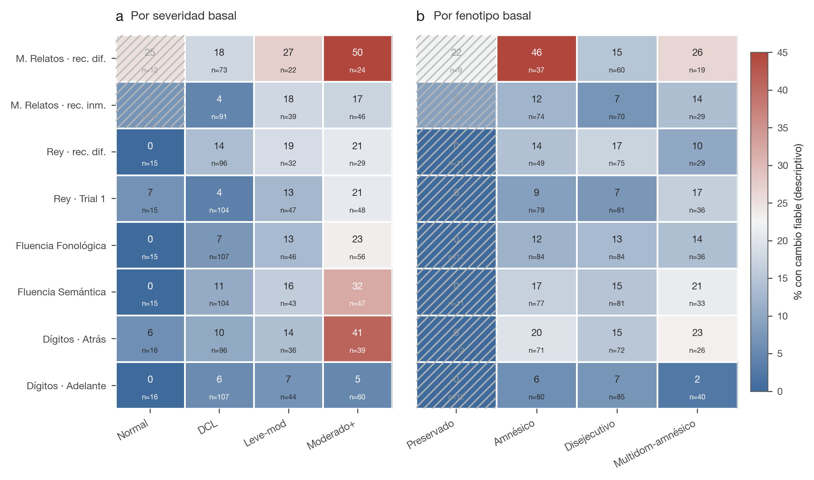
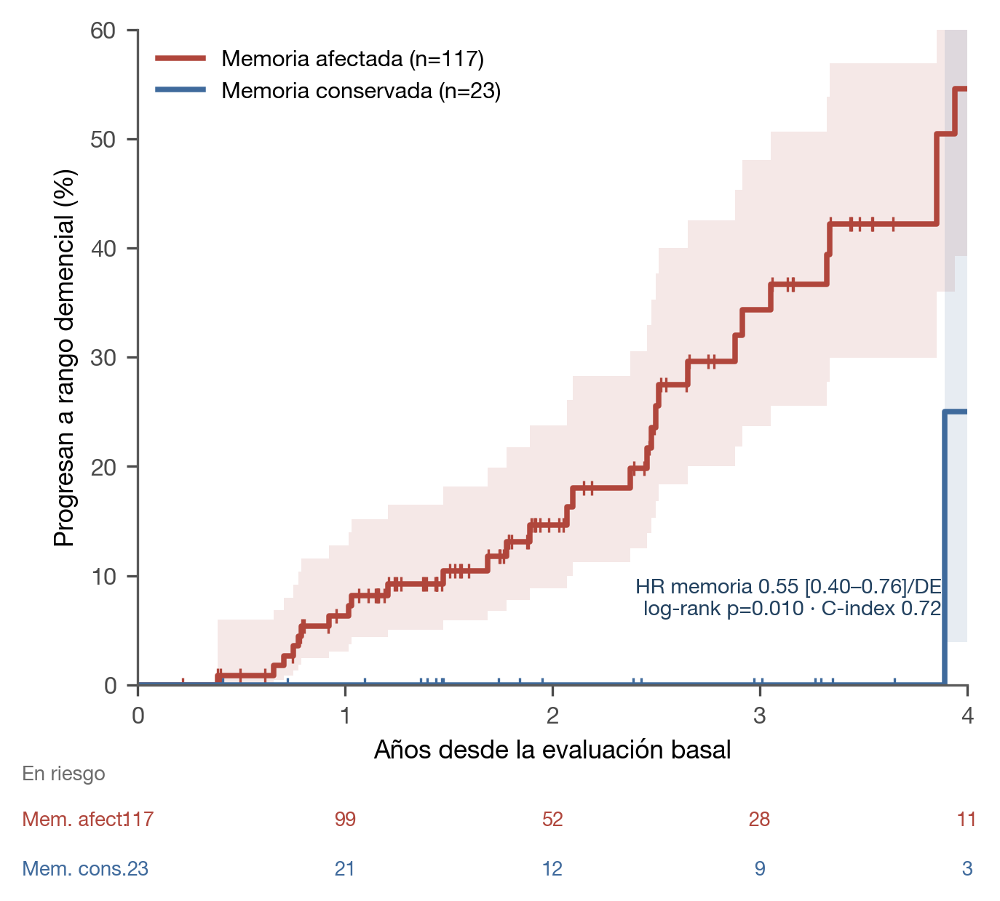

# Trayectorias cognitivas longitudinales y predicción de la progresión a demencia desde la evaluación basal en una clínica de memoria argentina: un estudio de mundo real

**Congreso Argentino de Neurología (CAN)** · Área temática: **Neurología Cognitiva, Demencias y Neuropsicología** · Tipo: Tema libre (oral/póster)

**Autores:** Fernando Márquez¹˒²˒⁴; Paula Virginia Arellano¹˒³˒⁴; Diana Bruno¹˒²; Luciana Vita¹⁻⁴; María Beatriz Bistué¹˒³˒⁴; María Celeste Moyano¹˒³˒⁴; María Laura Noguera Roberto¹; Mariana Zanino¹˒³˒⁴; Cristian Ignacio Posleman¹˒³˒⁴; Iara Jácome¹˒²; Florencia Portillo¹˒³˒⁴; Daniel Lucato²; Martín Alejandro Bruno¹˒³˒⁴.

**Afiliaciones:** ¹ Universidad Católica de Cuyo, San Juan, Argentina. ² Instituto de Neurociencias San Juan (Clínica El Castaño), San Juan, Argentina. ³ Hospital Dr. Guillermo Rawson, San Juan, Argentina. ⁴ Consejo Nacional de Investigaciones Científicas y Técnicas (CONICET), Argentina.

**Autor de correspondencia:** Fernando Márquez — fmarquez.mum@gmail.com

**Productos digitales de acceso abierto:**
- **Estratificador de riesgo (calculadora en el navegador):** https://fermarquez88.github.io/kaizenai-demencia/
- **Artefacto navegable de trayectoria cognitiva** (heatmaps + tabla maestra): enlazado desde la app.
- **Código, material suplementario y coeficientes:** https://github.com/fermarquez88/kaizenai-demencia — [material suplementario](suplementario/SUPLEMENTARIO.md).

> Reporte según **TRIPOD** (predicción) y **STROBE** (cohorte). Referencias verificadas vía **PubMed** (DOI). **Uso de inteligencia artificial declarado en Métodos.**

---

## Resumen (estructurado)

**Introducción.** La **trayectoria cognitiva longitudinal** de los perfiles neuropsicológicos en la práctica real de una
clínica de memoria —y qué de la evaluación basal anticipa la progresión— está poco caracterizada en Latinoamérica,
región subrepresentada en la investigación de demencias.

**Objetivo.** (1) Describir, a nivel de banda de severidad y de test, la **trayectoria cognitiva longitudinal** de los
perfiles en una cohorte argentina de mundo real; y (2) derivar y validar internamente modelos parsimoniosos, normados
localmente, que anticipen la progresión a demencia desde la evaluación basal.

**Materiales y métodos.** Estudio longitudinal retrospectivo de adultos con ≥2 evaluaciones neuropsicológicas en fechas
distintas (2020–2026), en el Instituto de Neurociencias San Juan. Tras una depuración auditada de la base (deduplicación
por hash, recuperación de perfiles desde el PDF firmado, corrección de fechas), el perfil se codificó desde la sección
Conclusiones mediante un modelo de lenguaje restringido por un codebook (uso de IA declarado). El **desenlace** fue la
**progresión a demencia**, definida por la severidad clínica del perfil ≥ moderada y **corroborada funcionalmente** por el
ADLQ del informante. La trayectoria se describió con la matriz de transición de bandas, con **cambio fiable basado en regresión** por
test (RCI/SRB, descriptivo) y con un análisis de **tiempo hasta el evento** (Kaplan-Meier, Cox). El modelo predictivo
pre-especificado (recuerdo diferido de relatos y edad) usó regresión logística con validación cruzada anidada, corrección
de optimismo, calibración de Platt e IC bootstrap.

**Resultados.** De 334 pacientes con múltiples visitas, 250 tuvieron reevaluación genuina (+4 recuperadas por corrección de
fecha = **254**; mediana 1,8 años); la recuperación de 63 perfiles del PDF dejó 219 analizables. La trayectoria fue **amnésico-céntrica**: el
compromiso objetivo de memoria fue el eje del riesgo (progresión 31% [36/117] vs 5% [1/22]; OR de Fisher 9,3; p=0,008), y
el análisis temporal lo confirmó (Cox: memoria HR 0,55 [IC95% 0,40–0,76] por DE; C-index 0,72; log-rank p=0,010). Ningún
paciente normal al basal progresó (0/17). El **modelo recuerdo diferido de relatos + edad** anticipó la progresión con **AUC 0,74
(IC95% bootstrap 0,63–0,83; 140 pacientes, 37 eventos)**, con estratificación de riesgo útil (progresión observada por
tercil 9%/26%/45%) y alto valor de descarte (VPN 92%). El análisis descriptivo de trayectoria por test sugirió patrones
fenotipo-específicos, si bien **ningún contraste sobrevivió la corrección por comparaciones múltiples** (q mín 0,091), por
lo que se reporta como generador de hipótesis. Añadir ánimo (GDS) o quejas (CQC) no mejoró la predicción.

**Conclusiones.** Los perfiles siguen una trayectoria amnésico-céntrica, con el compromiso de memoria como eje del riesgo,
y la progresión es anticipable con dos variables de rutina. Se despliegan dos herramientas abiertas. Los hallazgos son
exploratorios y unicéntricos; la demencia se definió por severidad clínica, corroborada funcionalmente por el ADLQ del
informante, y requiere validación externa.

**Palabras clave:** disfunción cognitiva; demencia; pruebas neuropsicológicas; recuerdo diferido; trayectoria cognitiva; estudios longitudinales; progresión de la enfermedad; índice de cambio fiable; América Latina.

---

## Introducción

El deterioro cognitivo leve (DCL) es una entidad heterogénea cuyo desenlace depende de cómo se lo define y del fenotipo
cognitivo subyacente.[1–3] El consenso internacional lo caracterizó como estado transicional con deterioro cognitivo
objetivo y **actividades de la vida diaria preservadas** —el rasgo que lo separa de la demencia— con subtipos amnésico y
no amnésico, de dominio único o múltiple, de pronóstico distinto.[1–3] Los criterios NIA-AA formalizaron el continuo
—DCL debido a enfermedad de Alzheimer[29] y **demencia**, que por definición exige compromiso **cognitivo y
funcional**[30]— y en la práctica la severidad se **estadifica clínicamente** (p. ej., el Clinical Dementia Rating).[31]
Dentro de este marco, es el **perfil neuropsicológico** —y no la mera presencia de deterioro— lo central para el
pronóstico.[4–6]

Dentro de ese perfil, la memoria episódica ocupa un lugar privilegiado: el **síndrome amnésico de tipo temporal medial**
identifica la enfermedad de Alzheimer prodrómica con alta especificidad,[7] el **recuerdo diferido** es uno de los
predictores más potentes de conversión,[7–13] y los **criterios neuropsicológicos actuariales** mejoran la estratificación
y reducen los falsos positivos.[14–16] El compromiso amnésico multidominio, la atrofia temporal medial y la carga vascular
incrementan el riesgo,[5,17,18] la **reserva** modula la expresión clínica,[19] y los síntomas conductuales pueden ser
prodrómicos.[20] La era de los biomarcadores redefinió la enfermedad de Alzheimer como constructo **biológico** (marco
AT(N)),[32] pero ese marco es explícitamente de investigación: la **estadificación clínica del síndrome** sigue siendo la
piedra angular de la práctica, sobre todo allí donde los biomarcadores no están disponibles.[30,32]

Esta caracterización importa hoy más que nunca: las primeras **terapias modificadoras de la enfermedad** (anticuerpos
anti-amiloide) actúan en estadios tempranos —DCL y demencia leve— y enlentecen modestamente la progresión clínica medida
por escalas de severidad,[33,34] lo que vuelve **accionable** identificar tempranamente al paciente de alto riesgo. Sin
embargo, la mayor parte de la evidencia proviene de cohortes de altos ingresos con baterías fijas, y **Latinoamérica está
marcadamente subrepresentada**: sistemas de salud frágiles, acceso limitado a biomarcadores y a terapias, y un llamado
regional explícito a desarrollar herramientas localmente y desde **medidas de rutina**.[23–25,35] Sobre este telón, dos
vacíos concretos motivan el trabajo: (i) la **trayectoria cognitiva longitudinal** en la práctica rara vez se describe con
el cuidado psicométrico que exigen los datos seriados (cambio fiable, regresión a la media, efecto de piso),[21,22] pese a
que la prevención depende de identificar la trayectoria temprana; y (ii) la **predicción de la progresión desde medidas de
rutina** es escasa en la región. Abordamos ambos con un objetivo primero **descriptivo** (la trayectoria cognitiva) y luego
**predictivo** (qué de la basal anticipa la progresión a demencia).

## Materiales y métodos

### Aspectos éticos y declaraciones
Análisis retrospectivo de datos clínicos de rutina, conducido conforme a los principios de la **Declaración de Helsinki** y
anonimizado por un identificador a nivel persona derivado del DNI; no se comparten datos identificatorios. Por tratarse de
datos asistenciales retrospectivos y anonimizados, no se requirió consentimiento adicional, conforme a la normativa
institucional para el uso secundario de datos asistenciales. **Financiamiento:** ninguno específico. **Conflictos de interés:** ninguno. **Uso de
inteligencia artificial:** un modelo de lenguaje restringido por un codebook cerrado se usó para **extraer y codificar**
el perfil desde el texto de las Conclusiones, y como asistencia en el análisis y la redacción; la IA **no** es autora y
toda decisión metodológica y de interpretación fue de los autores. **Contribuciones de los autores:** todos los autores
contribuyeron a la concepción o el diseño del trabajo, o a la adquisición, el análisis o la interpretación de los datos;
revisaron críticamente el manuscrito y aprobaron la versión final. **Disponibilidad:** los datos individuales son
sensibles y no se comparten; el código, el codebook, los coeficientes del modelo, los conteos agregados y el material
suplementario son abiertos.

### Diseño, cohorte y depuración de la base
Adultos evaluados entre 2020 y 2026 con **≥2 evaluaciones en fechas distintas**. Se depuró rigurosamente: (i) los
duplicados del mismo día se confirmaron por **hash SHA-256** (mismo archivo re-archivado) y se conservó la mejor copia;
(ii) se **recuperaron 63 perfiles** faltantes extrayendo la sección Conclusiones del PDF firmado y codificándola; (iii) se
**recuperaron 4 reevaluaciones** colapsadas por errores de fecha. La identidad se resolvió por DNI (Figura 1).

### Evaluación y codificación del perfil
Las baterías se adaptaron al motivo de consulta (ACE-III; IFS [INECO Frontal Screening]; Lista de Rey [RAVLT]; Memoria de
Relatos [Memoria Lógica de la WMS]; Figura de Rey [Figura Compleja de Rey-Osterrieth, ROCF]; fluencias verbales; dígitos;
Hayling; WAIS-IV; CI premórbido). Del texto de *Conclusiones* se codificó, mediante un LLM restringido
por codebook, la **banda de severidad** ordinal (normal / DCL / leve-moderado / moderado / moderado-grave / grave), el
mecanismo de memoria (almacenamiento vs. recuperación) y moduladores (ánimo, sueño). La **fiabilidad** entre dos
codificaciones ciegas fue alta (severidad κ=1,00; subtipo κ=0,88); esto refleja **consistencia de extracción, no
validación contra experto humano**, que queda pendiente. La clasificación operacional de **subtipo** (amnésico/no amnésico
× único/múltiple, umbral z ≤ −1,5; Petersen/Winblad) se derivó del patrón objetivo de dominios; **se restringió a los
pacientes en bandas no demenciales al basal** (las etiquetas de subtipo de DCL no aplican a quienes ya están en demencia
al basal).

### Desenlace, trayectoria y análisis temporal
El desenlace fue la **progresión a demencia**, definida operacionalmente por la **severidad clínica del perfil ≥ moderada**
en la reevaluación (estadificación del informe neuropsicológico, análoga a una escala clínica de severidad), y
**corroborada con un criterio funcional independiente**: el ADLQ del informante (grado de compromiso en actividades de la
vida diaria), medida que **no** deriva de la narrativa cognitiva. Se declara, como límite, que la banda de severidad y el
predictor de memoria comparten **fuente textual** (la narrativa de Conclusiones codificada por LLM) —riesgo de
**circularidad parcial**, atenuado por la corroboración funcional independiente— y que no hay confirmación biomarcadora ni
etiológica; por ello los resultados se interpretan como **exploratorios**. La proporción de progresión
se expresa por 100 persona-años en los reevaluados (no como incidencia poblacional). La trayectoria se describió con: (a) la **matriz de transición** entre bandas (Figura 2); (b) el
**cambio fiable por test**, re-escalando cada prueba a una referencia común (mediana/MAD basal, congelada) y cuantificando
el cambio con un **RCI basado en regresión** (SRB, Crawford-Howell) que descuenta la **regresión a la media** y el efecto de
práctica, excluyendo del denominador a los ya-en-piso al basal; la multiplicidad se controló por FDR
(Benjamini-Hochberg), y el resultado se presenta como **descriptivo/generador de hipótesis** (Figura 3, material
suplementario); y (c) un análisis de **tiempo hasta el evento** (Kaplan-Meier y Cox de riesgos proporcionales) que respeta el
seguimiento variable (Figura 4).

### Modelos predictivos y análisis estadístico
El modelo primario, **pre-especificado por teoría** (recuerdo diferido de relatos y edad), se derivó en la cohorte con
severidad basal leve o leve-moderada. Usó regresión logística penalizada (L2), con estandarización e imputación por la
mediana **dentro** de la validación cruzada anidada repetida (5×20) y **corrección de optimismo**. Se reportan: AUC con
**IC95% por bootstrap** (remuestreo de pacientes sobre las predicciones fuera-de-muestra; la dispersión entre folds fue
mayor y **no** se interpreta como IC), **calibración** (pendiente, índice de Brier e intercepto de calibración global) y **estratificación de
riesgo por terciles** con IC de Wilson. El **dato faltante** del predictor único (recuerdo diferido de relatos) se declara,
con análisis de sensibilidad en casos completos. Como modelos secundarios se reportan el subgrupo DCL y el **declive
cognitivo fiable** (para bandas normal y ya-demencial). Un modelo con **criterio funcional independiente (ADLQ)** se
presenta como análisis exploratorio (material suplementario) dada su fragilidad (EPV bajo). Los modelos desplegados
exportan coeficientes + Platt + bootstrap; una implementación en JavaScript reproduce los coeficientes (test de paridad).
Los análisis se realizaron en **Python** (scikit-learn, lifelines, pandas; DuckDB para la gestión de datos); las pruebas
de hipótesis fueron a **dos colas con α = 0,05** y la multiplicidad del análisis de trayectoria se controló por FDR
(Benjamini-Hochberg; 24 tests). Reporte según **TRIPOD**[28] (predicción) y **STROBE**[36] (cohorte).

## Resultados

### Cohorte y depuración (Figura 1, Tabla 1)
De 334 pacientes con más de una evaluación archivada, 84 se excluyeron (81 duplicados del mismo día confirmados por hash +
3 sin fecha válida); 250 tuvieron reevaluación genuina y la recuperación de fechas sumó 4 → **254 reevaluaciones**
(mediana 1,83 años; IQR 1,25–2,97). Tras recuperar 63 perfiles del PDF, **219** quedaron analizables con perfil basal y
final (vs. 182 antes de la depuración). La codificación fue altamente reproducible entre extracciones (severidad κ=1,00) y
creció monótonamente con el número de dominios objetivamente deficitarios.

### El desenlace "demencia" tiene correlato funcional independiente (validación de constructo)
La definición de demencia por severidad clínica se **corroboró con el ADLQ** del informante, una medida funcional
independiente de la narrativa cognitiva (disponible en **132/254 reevaluados, 52%**; comparación de grupos en los 121 con
banda final y ADLQ). El compromiso funcional creció de forma **monótona con la severidad cognitiva** (mediana de áreas
alteradas: Normal 6% → DCL 20% → leve-moderado 29% → moderado 35% → moderado-grave 50% → grave 72%; Figura S3), y el grupo
con **demencia** mostró más compromiso que el grupo sin demencia (mediana **42% vs 19%**; con compromiso marcado [≥40%]
**55% vs 15%**). Esta corroboración opera **a nivel de grupo** (validación de constructo agregada), no como criterio
diagnóstico por caso; el solapamiento distribucional delimita el alcance del término (≈45% de los clasificados como
demencia no alcanza el umbral funcional individual, y ≈18% de los DCL sí lo alcanza). Es, por tanto, **consistente en
promedio con compromiso funcional acompañante** —lo que respalda el constructo y atenúa la circularidad, dado que el ADLQ
es independiente de la narrativa—, con el límite de su cobertura parcial (52%).

### Trayectoria a nivel de banda de severidad: transiciones (Figura 2)
La mayoría de los perfiles se mantuvieron estables o progresaron un escalón. En la cohorte del modelo (leve-moderado,
n=140, 308 persona-años), la progresión a demencia fue de **12,0 por 100 persona-años** (37 eventos; IC95% Poisson
8,5–16,6); esta tasa es **condicional a la reevaluación** y su dirección de sesgo es indeterminada (véase Limitaciones).
Las transiciones se concentraron sobre la diagonal y su vecindad; **ningún paciente normal al basal progresó directamente
a demencia (0/17)**, coherente con un modelo por estadios.

### Trayectoria a nivel de test: cambio cognitivo fiable, descriptivo (Figura 3)
El análisis de cambio fiable por test —tras re-escalar, descontar la regresión a la media y manejar el efecto de piso—
sugirió patrones **fenotipo-específicos** de progresión (más cambio en recuerdo episódico diferido en los perfiles
amnésicos; en velocidad/ejecutivo en los disejecutivos; amplio en los amnésico-multidominio), con un gradiente por
severidad basal (Normal ~4% → moderado o mayor ~22% de cambio fiable). **No obstante, ningún contraste a nivel de test
sobrevivió la corrección por comparaciones múltiples (FDR; q mínimo 0,091; p. ej., Recuerdo diferido de relatos p=0,276,
q=0,43), y muchas celdas fenotipo-específicas descansan en n<15.** En consecuencia, estos patrones se reportan como
**estrictamente descriptivos y generadores de hipótesis**, no como hallazgos confirmatorios ni como una patrón mecanístico.
Un hallazgo psicométrico relevante y robusto es que los tests de recuerdo diferido de relatos están fuertemente **en piso** al basal
en una clínica de memoria (censura por abajo), lo que enmascara su cambio en la métrica cruda: interpretar el cambio
seriado sin RCI y sin manejar el piso conduce a conclusiones erróneas.

### El compromiso de memoria es el eje del riesgo, en el tiempo (Figura 4)
El compromiso objetivo de memoria fue el eje del riesgo: en la cohorte en riesgo, los perfiles con **memoria afectada**
(z ≤ −1,5) progresaron mucho más que los de memoria conservada (**31%** [36/117] vs **5%** [1/22]; OR de Fisher **9,3**;
p=0,008 —IC95% muy amplio por el único evento en el grupo conservado, por lo que la estimación robusta es el HR de Cox). El
análisis de **tiempo hasta el evento**, que respeta el seguimiento variable, lo confirmó: la incidencia acumulada
de progresión a 2 y 3 años fue 15% y 34% con memoria afectada vs ~0% con memoria conservada (**log-rank p=0,010**); en el
modelo de Cox, mejor memoria se asoció a menor riesgo (**HR 0,55 [IC95% 0,40–0,76] por DE**; edad HR 1,32 [0,79–2,18]),
con **C-index 0,72**, concordante con el AUC logístico. Coherentemente, la cohorte en riesgo estuvo dominada por el
subtipo **amnésico multidominio (≈76%; 120/158)**, y —en las bandas no demenciales al basal, donde aplican las etiquetas de
subtipo— el patrón multidominio objetivo fue predominantemente **amnésico (88%; 122/139)**. Entre esos amnésicos, el
mecanismo de **almacenamiento** (patrón de codificación/consolidación, sugestivo de compromiso temporal medial) fue el más
frecuente (**58%; 67/116** con mecanismo evaluable), sin predominio marcado sobre el de recuperación (42%); este patrón
**enriquece** la caracterización del subtipo amnésico pero, en esta muestra, **no estratifica el riesgo más allá del propio
subtipo**.

### Qué anticipa la progresión: modelos predictivos (Figura 5, Tabla 2)
El modelo **pre-especificado de dos variables —recuerdo diferido de relatos y edad—** anticipó la progresión con **AUC
0,74 (IC95% bootstrap 0,63–0,83)** en la cohorte leve-moderado (140 pacientes, 37 eventos; EPV 18,5; **13 pacientes [9%]
con el predictor de memoria imputado — casos completos 127/35, AUC concordante**). Su utilidad principal es la
**estratificación de riesgo**: la progresión observada creció por tercil de riesgo predicho (**9% → 26% → 45%**; n≈47 por
tercil), con **VPN 92%** (buen descarte) y VPP ~45%. La **calibración** de la discriminación fue adecuada (pendiente 0,88);
el ajuste con ponderación por clases sobre-estima el riesgo absoluto, corregido mediante recalibración de Platt en el
despliegue, por lo que la herramienta se interpreta como **estratificador de riesgo relativo**, no como calculadora de
probabilidad individual exacta. Añadir la severidad basal (casi-circular; +0,01 de AUC), el **GDS** o el **CQC** no mejoró
la discriminación. En el subgrupo DCL rindió AUC 0,76 (IC95% 0,59–0,88; 96/18) y el modelo de declive cognitivo fiable
0,68 (0,58–0,77; 250/47). Un modelo de árbol de AUC aparente 0,97 colapsó a ~0,66 bajo corrección de optimismo
(sobreajuste). El análisis exploratorio con criterio funcional independiente (ADLQ) es frágil y se reporta en el material
suplementario.

## Discusión

En una clínica de memoria argentina de mundo real, los perfiles neuropsicológicos siguieron una trayectoria
**amnésico-céntrica**, y la progresión se anticipó con un modelo parsimonioso, normado localmente. Discutimos los
hallazgos bajo la lente de la evidencia de alto impacto y su **utilidad para el neurólogo cognitivo**.

**El eje del riesgo es la memoria — y esto orienta la conducta clínica.** El riesgo de progresión fue varias veces mayor
con memoria comprometida (OR 9,3), y el análisis temporal (Cox HR 0,55/DE; C-index 0,72) mostró que la señal es estable en
el tiempo. Es consistente con la evidencia de que el síndrome amnésico de tipo temporal medial identifica la EA prodrómica
con alta especificidad[7] y con el recuerdo diferido como predictor central de conversión,[8–13] y con que el DCL amnésico
multidominio conlleva mayor riesgo.[5,17] Para el neurólogo cognitivo, la implicancia es concreta: **ante un DCL, el peso
del compromiso de memoria episódica de almacenamiento debe elevar el umbral de vigilancia, acortar el intervalo de
reevaluación y motivar la búsqueda etiológica** (biomarcadores, neuroimagen de lóbulo temporal medial), mientras que un
perfil no amnésico con memoria conservada, en esta muestra, tuvo un riesgo de progresión marcadamente menor.

**La interpretación del cambio seriado exige psicometría de cambio fiable — y disciplina inferencial.** La regresión a la
media y el efecto de piso distorsionan el cambio crudo: en una clínica de memoria, los tests de recuerdo diferido de relatos están
saturados al basal y parecen “estables” por censura. El RCI basado en regresión y el manejo explícito del piso son
imprescindibles, y aportamos normas locales de cambio fiable, de las primeras para esta población. Ahora bien, somos
deliberadamente cautos: **ningún contraste de trayectoria por test sobrevivió la corrección por comparaciones múltiples**,
por lo que los patrones fenotipo-específicos se ofrecen como **hipótesis a confirmar**, no como una patrón mecanístico. Esta
autocontención —reportar el patrón sin sobre-interpretarlo— es, en sí, un mensaje metodológico para la lectura de datos
seriados en la práctica.[26,27]

**Un modelo de dos variables ofrece utilidad de rutina como estratificador de riesgo.** Recuerdo diferido y edad
anticiparon la progresión (AUC 0,74; IC95% 0,63–0,83), sobre todo como **prueba de descarte** (VPN 92%) y **ordenador de
riesgo** (progresión 9%→45% del tercil inferior al superior). Para el neurólogo cognitivo sin acceso rutinario a
biomarcadores —la realidad de gran parte de Latinoamérica[23–25]— esto es directamente accionable: **dos números de una
evaluación estándar ubican al paciente en una banda de riesgo relativo que informa la frecuencia de seguimiento y la
priorización de estudios**, sin sustituir el juicio clínico. Esta accionabilidad es especialmente oportuna en la **era de
las terapias modificadoras**: los anticuerpos anti-amiloide actúan en estadios tempranos y su ventana depende de
identificar pronto al paciente en riesgo;[33,34] cuando esa es la lógica asistencial, un estratificador basado en la
evaluación de rutina —barato y sin biomarcadores— funciona como primer filtro para **priorizar derivación y vigilancia**
(no como criterio de elegibilidad para anti-amiloide, que exige confirmación de amiloide y no se infiere de un modelo
clínico), en línea con las iniciativas regionales (LAC-CD/ReDLat)[35] y con el énfasis de las Comisiones del Lancet en la
prevención a lo largo del curso vital.[21,22] El techo del desempeño lo fija el tamaño muestral y la ausencia de biomarcadores más que el algoritmo,
consistente con las iniciativas que buscan extraer el máximo de **medidas de rutina** y anticipan el aporte de
biomarcadores en sangre en la región.[24,25]

**Alcance y encuadre honestos.** La demencia se definió **operacionalmente por la severidad clínica del perfil**
(≥ moderada), y esta definición se **corroboró con un criterio funcional independiente**: en el grupo con demencia, el
ADLQ del informante mostró compromiso funcional (mediana 42% de áreas alteradas vs 19% en no-demencia; gradiente monótono
Normal 6% → grave 72%), lo que respalda el constructo (deterioro cognitivo **y** funcional) y **atenúa** —sin eliminar— la
preocupación por circularidad, pues el ADLQ es independiente de la narrativa cognitiva que informa el predictor. Esta
operacionalización es coherente con la definición vigente de demencia —que exige compromiso **cognitivo y funcional**[30]—
y con la estadificación clínica de severidad;[31] y, crucialmente, predice una **trayectoria clínica**, no la enfermedad de
Alzheimer **definida biológicamente** (marco AT(N)),[32] que requeriría biomarcadores ausentes en esta cohorte. Persisten
límites (cobertura del ADLQ 52%, corroboración a nivel de grupo, sin biomarcadores ni confirmación etiológica), por lo que la contribución se enmarca como
un **estratificador de riesgo** normado localmente, no un diagnosticador. Dos productos digitales abiertos materializan el trabajo y corren íntegramente
en el navegador (sin transmitir datos): un **estratificador de riesgo** individual (Figura 6) y un **artefacto navegable
de trayectoria cognitiva**, que llevan la descripción y la estratificación a la consulta.

**Fortalezas y limitaciones.** Fortalezas: datos genuinos de mundo real; depuración e identificación auditadas con
recuperación de N; una variable perfil reproducible; psicometría de cambio fiable con control de multiplicidad; validación
interna con IC bootstrap y calibración reportados según TRIPOD[28]/STROBE[36]; análisis de tiempo hasta el evento; y liberación
abierta de código y herramientas. Limitaciones que acotan las conclusiones a un nivel exploratorio: (i) **unicéntrico**,
con eventos escasos (subgrupos con EPV bajo e IC amplios); (ii) **demencia definida por severidad clínica**, con
corroboración funcional independiente (ADLQ) de **cobertura parcial (52%)**, a nivel de grupo, y posible circularidad
residual predictor–desenlace; (iii) **codificación por IA** = extracción de texto con fiabilidad LLM–LLM, pendiente de
validación contra experto humano; (iv) **sesgo de selección** de quiénes se reevalúan y **censura informativa**: la tasa es
condicional a la reevaluación y, dado que la clínica de memoria tiende a re-citar a quienes empeoran, la dirección del
sesgo es **indeterminada** (no un límite inferior); además, no se dispuso de estado vital, por lo que **no se modeló el
riesgo competitivo de muerte** y las cifras de incidencia acumulada del Kaplan-Meier deben leerse con esa reserva; (v)
**datos faltantes** en el predictor de memoria (9%) manejados por imputación, con sensibilidad en casos completos; (vi)
desenlace binario a seguimiento variable, mitigado —no resuelto— por el análisis de Cox; (vii) mayoría con
solo 2 visitas (85%), lo que impide modelar la forma de la trayectoria individual (por eso el análisis de trayectoria es
descriptivo). La **validación externa** —en consorcios regionales y frente a biomarcadores en sangre[25]— es el paso
esencial.

## Conclusiones
Los perfiles cognitivos siguen una trayectoria amnésico-céntrica; el compromiso de memoria episódica de almacenamiento es
el eje del riesgo de progresión, estable en el análisis temporal. La progresión a demencia es
anticipable con recuerdo diferido de relatos y edad, útil como prueba de descarte y estratificador de riesgo. Se aportan dos productos
digitales abiertos. Los hallazgos son exploratorios y unicéntricos; la demencia se definió por severidad clínica,
corroborada funcionalmente por el ADLQ (independiente de la narrativa cognitiva), y se requiere validación externa.

---

## Tablas

**Tabla 1. Cohorte, depuración y fiabilidad de la codificación.**

| Variable | Reevaluación (n = 254) | Una visita (n = 2644) |
|---|---|---|
| Edad, años (media ± DE) | 66,9 ± 14,3 | 63,8 ± 19,1 |
| Educación, años (media ± DE) | 13,4 ± 3,4 | 12,8 ± 3,7 |
| Sexo femenino, % | 56 | 56 |
| Seguimiento, años, mediana (IQR) | 1,83 (1,25–2,97) | — |

*Depuración: 84 exclusiones (81 duplicados mismo día por hash + 3 sin fecha); 63 perfiles y 4 reevaluaciones recuperados →
219 analizables (basal y final). Fiabilidad entre dos codificaciones ciegas (κ, extracción LLM–LLM, no vs experto humano):
severidad 1,00; subtipo 0,88.*

**Tabla 2. Rendimiento de los modelos (TRIPOD; validación interna, optimismo-corregido).**

| Desenlace / cohorte | n / eventos | Predictores | AUC [IC95% bootstrap] |
|---|---|---|---|
| **Demencia — leve-moderado (primario)** | 140 / 37 | Recuerdo diferido de relatos + edad | **0,74** [0,63–0,83] |
| Demencia — subgrupo DCL | 96 / 18 | Recuerdo diferido de relatos + edad | 0,76 [0,59–0,88] |
| Declive cognitivo fiable (bandas normal/demencial) | 250 / 47 | edad, Rey trial 1, intrusiones, CI premórbido, Hayling | 0,68 [0,58–0,77] |

*Estratificación (modelo primario): progresión observada por tercil 9% / 26% / 45% (n≈47 c/u); VPN 92%, VPP ~45%;
calibración pendiente 0,88, Brier 0,21 (el ajuste ponderado sobre-estima el riesgo absoluto, recalibrado por Platt en el
despliegue). El predictor de memoria estuvo imputado en 13/140 (9%); casos completos 127/35, AUC concordante. El IC95% es
bootstrap sobre predicciones fuera-de-muestra; la dispersión entre folds fue mayor y no es un IC. El modelo primario
coincide con `models_deploy.json` en n/eventos/coeficientes. Análisis funcional ADLQ y detalle: material suplementario.*

## Figuras

**Figura 1. Flujo de la cohorte y depuración (STROBE).** 
*334 con ≥2 evaluaciones → 84 excluidos (81 duplicados por hash + 3 sin fecha) → 254 reevaluaciones (4 recuperadas); 63
perfiles recuperados del PDF → 219 analizables; cohortes DCL (96) y leve-moderado (140).*

**Figura 2. Trayectoria de banda: matriz de transición de severidad (basal → reevaluación).** 
*Proporción por fila; sobre la diagonal = progresión. Ningún normal basal progresó a demencia.*

**Figura 3. Cambio fiable por test, descriptivo (por severidad y por fenotipo basal).** 
*% de pacientes con cambio fiable (RCI basado en regresión) por test, excluidos los ya-en-piso al basal. **Análisis
descriptivo/generador de hipótesis: ningún contraste sobrevive corrección FDR (q mín 0,091); celdas rayadas n<15, no
interpretables.** El n figura en cada celda.*

**Figura 4. El eje del riesgo en el tiempo: incidencia acumulada de progresión por estado de memoria basal (Kaplan-Meier).** 
*Cohorte leve-moderado. Cox: memoria HR 0,55 [0,40–0,76]/DE; log-rank p=0,010; C-index 0,72. Bandas: IC95%; marcas: censura.*

**Figura 5. Qué anticipa la progresión: rendimiento del modelo (memoria + edad).** 
*(a) Discriminación (AUC 0,74 [0,63–0,83]); (b) estratificación por tercil de riesgo (9%/26%/45%); (c) efectos (OR en dirección de riesgo).*

**Figura 6. Estratificador de riesgo desplegado (en el navegador).** 
*Prototipo de investigación, no validado para decisión clínica. https://fermarquez88.github.io/kaizenai-demencia/*

---

## Referencias
*Recuperadas y verificadas vía PubMed. Se incluye DOI.*

1. Petersen RC, Smith GE, Waring SC, et al. Mild cognitive impairment: clinical characterization and outcome. *Arch Neurol.* 1999. https://doi.org/10.1001/archneur.56.3.303
2. Petersen RC, Doody R, Kurz A, et al. Current concepts in mild cognitive impairment. *Arch Neurol.* 2001. https://doi.org/10.1001/archneur.58.12.1985
3. Winblad B, Palmer K, Kivipelto M, et al. Mild cognitive impairment — beyond controversies, towards a consensus. *J Intern Med.* 2004. https://doi.org/10.1111/j.1365-2796.2004.01380.x
4. Ganguli M, Snitz BE, Saxton JA, et al. Outcomes of mild cognitive impairment by definition: a population study. *Arch Neurol.* 2011. https://doi.org/10.1001/archneurol.2011.101
5. Espinosa A, Alegret M, Valero S, et al. A longitudinal follow-up of 550 mild cognitive impairment patients. *J Alzheimers Dis.* 2013. https://doi.org/10.3233/JAD-122002
6. Allegri RF, Glaser FB, Taragano FE, Buschke H. Mild cognitive impairment: believe it or not? *Int Rev Psychiatry.* 2008. https://doi.org/10.1080/09540260802095099
7. Sarazin M, Berr C, De Rotrou J, et al. Amnestic syndrome of the medial temporal type identifies prodromal AD: a longitudinal study. *Neurology.* 2007. https://doi.org/10.1212/01.wnl.0000279336.36610.f7
8. Gainotti G, Quaranta D, Vita MG, Marra C. Neuropsychological predictors of conversion from MCI to Alzheimer's disease. *J Alzheimers Dis.* 2014. https://doi.org/10.3233/JAD-130881
9. Modrego PJ. Predictors of conversion to dementia of probable Alzheimer type in patients with MCI. *Curr Alzheimer Res.* 2006. https://doi.org/10.2174/156720506776383103
10. García-Herranz S, Díaz-Mardomingo MC, Peraita H. Neuropsychological predictors of conversion to probable Alzheimer disease in elderly with MCI. *J Neuropsychol.* 2016. https://doi.org/10.1111/jnp.12067
11. López ME, Turrero A, Cuesta P, et al. A multivariate model of time to conversion from MCI to Alzheimer's disease. *GeroScience.* 2020. https://doi.org/10.1007/s11357-020-00260-7
12. Park HK, Choi SH, Park SA, et al. Memory performance on the story recall test and prediction of progression in MCI and Alzheimer's dementia. *Geriatr Gerontol Int.* 2017. https://doi.org/10.1111/ggi.12940
13. Bao J, Wang Y, Qu D, et al. Impairment of delayed recall as a predictor of amnestic MCI development in normal older adults. *BMC Psychiatry.* 2023. https://doi.org/10.1186/s12888-023-05309-3
14. Bondi MW, Edmonds EC, Jak AJ, et al. Neuropsychological criteria for MCI improves diagnostic precision, biomarker associations, and progression rates. *J Alzheimers Dis.* 2014. https://doi.org/10.3233/JAD-140276
15. Jak AJ, Preis SR, Beiser AS, et al. Neuropsychological criteria for MCI and dementia risk in the Framingham Heart Study. *J Int Neuropsychol Soc.* 2016. https://doi.org/10.1017/S1355617716000199
16. Wong CG, Thomas KR, Edmonds EC, et al. Neuropsychological criteria for MCI in the Framingham Heart Study's old-old. *Dement Geriatr Cogn Disord.* 2018. https://doi.org/10.1159/000493541
17. Lee YC, Kang JM, Lee H, et al. Amnestic multiple cognitive domains impairment and periventricular WMH predict progression to dementia in MCI. *Int J Geriatr Psychiatry.* 2016. https://doi.org/10.1002/gps.4035
18. Persson K, Eldholm RS, Barca ML, et al. Visual evaluation of medial temporal lobe atrophy as a marker of conversion from MCI to dementia. *Dement Geriatr Cogn Disord.* 2017. https://doi.org/10.1159/000477342
19. Mortimer JA, Borenstein AR, Gosche KM, Snowdon DA. Very early detection of Alzheimer neuropathology and the role of brain reserve. *J Geriatr Psychiatry Neurol.* 2005. https://doi.org/10.1177/0891988705281869
20. Taragano FE, Allegri RF, Lyketsos C. Mild behavioral impairment: a prodromal stage of dementia. *Dement Neuropsychol.* 2008. https://doi.org/10.1590/S1980-57642009DN20400004
21. Livingston G, Huntley J, Sommerlad A, et al. Dementia prevention, intervention, and care: 2020 report of the Lancet Commission. *Lancet.* 2020. https://doi.org/10.1016/S0140-6736(20)30367-6
22. Livingston G, Huntley J, Liu KY, et al. Dementia prevention, intervention, and care: 2024 report of the Lancet standing Commission. *Lancet.* 2024. https://doi.org/10.1016/S0140-6736(24)01296-0
23. Parra MA, Baez S, Allegri R, et al. Dementia in Latin America: assessing the present and envisioning the future. *Neurology.* 2018. https://doi.org/10.1212/WNL.0000000000004897
24. Maito MA, Santamaría-García H, Moguilner S, et al. Classification of Alzheimer's disease and frontotemporal dementia using routine clinical and cognitive measures across multicentric underrepresented samples. *Lancet Reg Health Am.* 2022. https://doi.org/10.1016/j.lana.2022.100387
25. Caviedes A, et al. Blood-based AT(N) biomarkers for Alzheimer's disease and frontotemporal lobar degeneration in Latin America. *Nat Aging.* 2026. https://doi.org/10.1038/s43587-025-01061-3
26. Jacobson NS, Truax P. Clinical significance: a statistical approach to defining meaningful change in psychotherapy research. *J Consult Clin Psychol.* 1991. https://doi.org/10.1037/0022-006X.59.1.12
27. Tröster AI, Woods SP, Morgan EE. Assessing cognitive change in Parkinson's disease: practice effect-corrected reliable change indices. *Arch Clin Neuropsychol.* 2007. https://doi.org/10.1016/j.acn.2007.05.004
28. Collins GS, Reitsma JB, Altman DG, Moons KGM. Transparent reporting of a multivariable prediction model (TRIPOD). *Ann Intern Med.* 2015. https://doi.org/10.7326/M14-0697
29. Albert MS, DeKosky ST, Dickson D, et al. The diagnosis of mild cognitive impairment due to Alzheimer's disease: recommendations from the NIA-AA workgroups. *Alzheimers Dement.* 2011. https://doi.org/10.1016/j.jalz.2011.03.008
30. McKhann GM, Knopman DS, Chertkow H, et al. The diagnosis of dementia due to Alzheimer's disease: recommendations from the NIA-AA workgroups. *Alzheimers Dement.* 2011. https://doi.org/10.1016/j.jalz.2011.03.005
31. Morris JC. The Clinical Dementia Rating (CDR): current version and scoring rules. *Neurology.* 1993. https://doi.org/10.1212/wnl.43.11.2412-a
32. Jack CR, Bennett DA, Blennow K, et al. NIA-AA Research Framework: toward a biological definition of Alzheimer's disease. *Alzheimers Dement.* 2018. https://doi.org/10.1016/j.jalz.2018.02.018
33. van Dyck CH, Swanson CJ, Aisen P, et al. Lecanemab in early Alzheimer's disease. *N Engl J Med.* 2023. https://doi.org/10.1056/NEJMoa2212948
34. Sims JR, Zimmer JA, Evans CD, et al. Donanemab in early symptomatic Alzheimer disease: the TRAILBLAZER-ALZ 2 randomized clinical trial. *JAMA.* 2023. https://doi.org/10.1001/jama.2023.13239
35. Ibáñez A, Parra MA, Butler C, et al. The Latin America and the Caribbean Consortium on Dementia (LAC-CD): from networking to research to implementation science. *J Alzheimers Dis.* 2021. https://doi.org/10.3233/JAD-201384
36. von Elm E, Altman DG, Egger M, et al. The Strengthening the Reporting of Observational Studies in Epidemiology (STROBE) statement: guidelines for reporting observational studies. *J Clin Epidemiol.* 2008. https://doi.org/10.1016/j.jclinepi.2007.11.008
