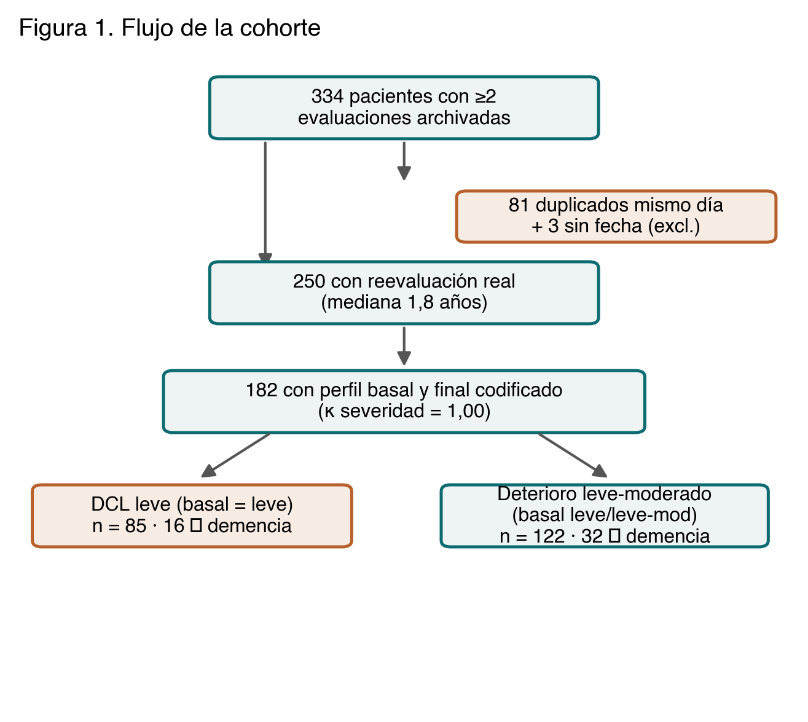
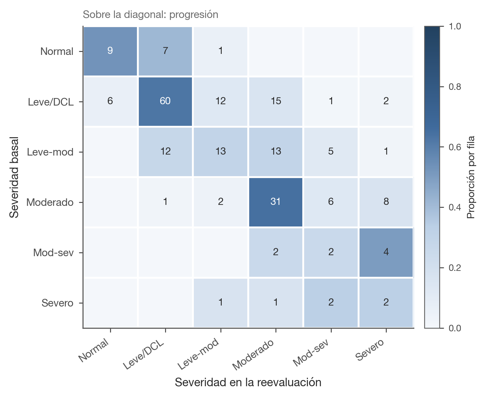
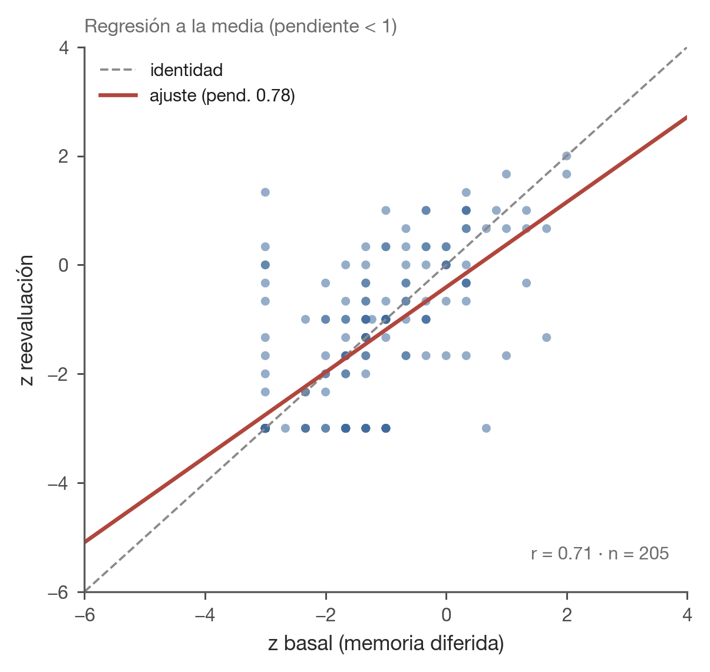
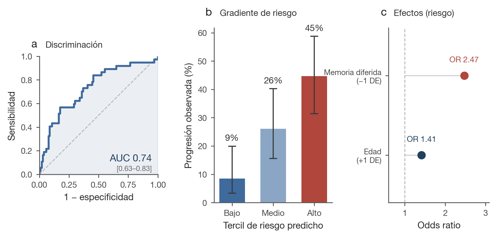
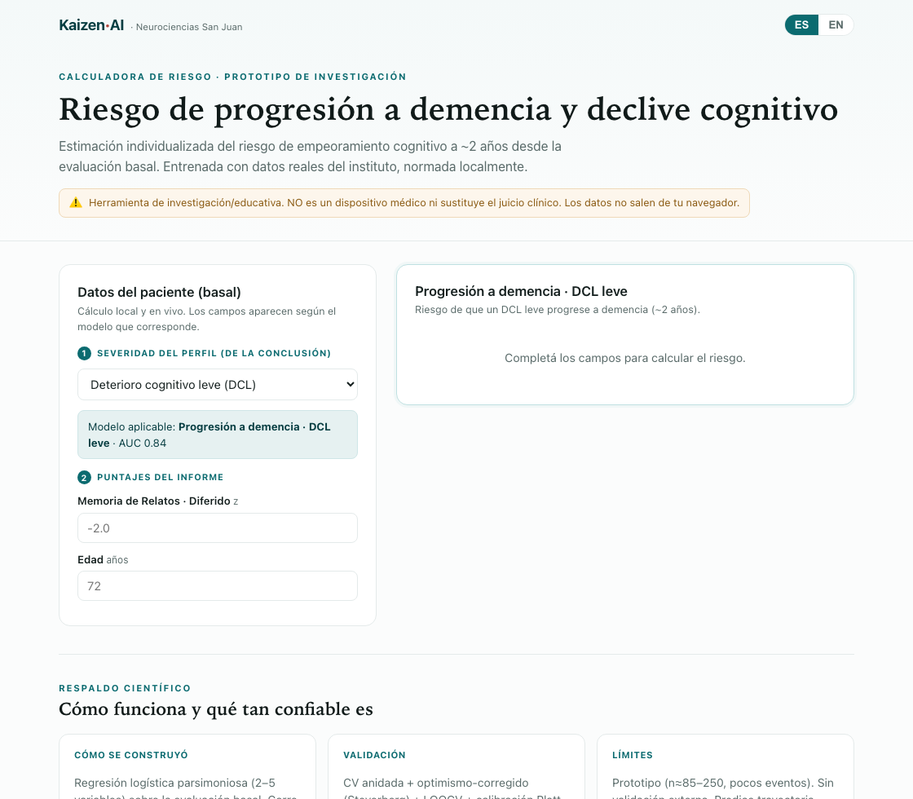

# Evolución de los perfiles neuropsicológicos y predicción de la progresión a demencia en una clínica de memoria argentina: estudio longitudinal de mundo real

**Congreso Argentino de Neurología (CAN)** · Área temática: **Neurología Cognitiva, Demencias y Neuropsicología** · Tipo: Tema libre (oral/póster)

**Autores:** Fernando Márquez (MD)¹; Diana Bruno (Lic.)¹; [coautores]. ¹ Instituto de Neurociencias San Juan (Clínica El Castaño), San Juan, Argentina.
**Autor de correspondencia:** F. Márquez — fmarquez.mum@gmail.com

**Código y calculadora (acceso abierto):** https://github.com/fermarquez88/kaizenai-demencia · App: https://fermarquez88.github.io/kaizenai-demencia/

> Las referencias fueron recuperadas y verificadas mediante **PubMed**; se incluye el DOI de cada cita.

---

## Resumen (estructurado)

**Introducción y objetivos.** Cómo evolucionan los distintos perfiles neuropsicológicos en la práctica real de una
clínica de memoria —y si esa evolución puede predecirse desde la evaluación basal— está poco caracterizado en
Latinoamérica, región históricamente subrepresentada en la investigación de demencias. Los objetivos fueron:
(1) describir la evolución longitudinal de los perfiles cognitivos en una cohorte argentina de mundo real, y
(2) derivar y validar internamente modelos parsimoniosos, normados localmente, que predigan la progresión a demencia.

**Materiales y métodos.** Estudio longitudinal retrospectivo de adultos con ≥2 evaluaciones neuropsicológicas en fechas
distintas en un único instituto (2020–2026). El perfil (banda de severidad, fenotipo dominante, mecanismo de memoria)
se extrajo de la sección Conclusiones del informe firmado mediante un codebook, con validación de **fiabilidad**
(doble codificación independiente) y de **validez de constructo** (contra un patrón z objetivo). Las trayectorias se
analizaron con cambio **ajustado por el basal** (residuo ANCOVA) y con un **Índice de Cambio Fiable (RCI)** derivado
localmente. La progresión a demencia se definió como severidad final ≥ moderada. Los modelos pronósticos emplearon
regresión logística penalizada con validación cruzada anidada, corrección de optimismo por bootstrap y calibración de
Platt, reportados según TRIPOD.

**Resultados.** De 334 pacientes con múltiples visitas, 250 tuvieron una reevaluación genuina (mediana de seguimiento
1,8 años). La codificación del perfil fue altamente reproducible (severidad κ=1,00; fenotipo κ=0,88) y creció de forma
monótona con el z objetivo. Tras el ajuste por el basal —obligatorio dada la fuerte **regresión a la media**
(r basal–final=0,26)— y clasificando por subtipos de Petersen, el **DCL amnésico multidominio** mostró la mayor
progresión a demencia (**59%**, IC95% 46–71), muy por encima del **no amnésico (disejecutivo/atencional)** (22%) y del
**amnésico de dominio único** (8%; χ² p=0,012). El subtipo amnésico se caracterizó por **compromiso del almacenamiento**
(tipo hipocampal; 93% de los casos amnésicos) y los perfiles con **modulador anímico** declinaron menos (20% vs 36%). De 14 pacientes normales al basal, **ninguno** progresó a demencia
(0/14) —consistente con, aunque sin poder para probar, un modelo por estadios. Se aportan normas locales de cambio
(RCI global ≈0,97 z). La progresión a demencia se predijo con **memoria de relatos diferida y edad** (DCL→demencia AUC
0,84 [IC95% 0,54–1,0], 16 eventos; deterioro leve-moderado→demencia 0,80 [0,64–0,92], n=122); los modelos parsimoniosos igualaron o
superaron a la selección de alta dimensión.

**Conclusiones.** Los perfiles cognitivos evolucionan por caminos fenotipo-específicos y biológicamente coherentes que
quedan ocultos si el cambio no se ajusta por el basal. Un modelo de dos variables —recuerdo diferido de relatos más
edad— predice la progresión a demencia con un rendimiento comparable al de modelos publicados basados en
neuropsicología, y se despliega como calculadora abierta que preserva la privacidad. Se requiere validación externa.

**Palabras clave:** deterioro cognitivo leve; demencia; neuropsicología; predicción; Latinoamérica; índice de cambio fiable.

---

## Introducción

El deterioro cognitivo leve (DCL) es una construcción heterogénea cuyo desenlace depende fuertemente de cómo se lo
defina y del fenotipo cognitivo subyacente.[1,2] Estudios poblacionales y de clínica muestran que una proporción
sustancial de pacientes rotulados como DCL progresa a demencia mientras otros permanecen estables o revierten, y que
los subtipos amnésico y no-amnésico conllevan pronósticos distintos.[1,3] La controversia sobre las tasas de conversión
y la propia identidad del DCL ha sido señalada tempranamente por autores de nuestra región.[4] En consecuencia, es el
**perfil neuropsicológico** —y no la mera presencia de deterioro— lo central para el pronóstico.

Una literatura consistente identifica a la memoria episódica, y en particular al **recuerdo diferido**, como el
predictor neuropsicológico más potente de conversión de DCL a enfermedad de Alzheimer.[5–10] El recuerdo diferido de
relatos (memoria lógica) y de listas supera repetidamente a las medidas de cribado global para anticipar la
progresión,[9,10] y los criterios neuropsicológicos actuariales mejoran la estratificación del riesgo por encima de las
definiciones convencionales.[11] El compromiso amnésico multidominio, la atrofia temporal medial y la carga vascular
incrementan el riesgo,[3,12,13] mientras que la **reserva cognitiva/cerebral** modifica la expresión clínica de una
misma carga de patología.[14] Los síntomas conductuales/anímicos, además, pueden constituir un pródromo
propio.[15] Sin embargo, la mayor parte de esta evidencia proviene de cohortes de investigación de países de altos
ingresos, con baterías fijas y seguimiento protocolizado.

Dos vacíos motivan este trabajo. Primero, la **evolución longitudinal de los perfiles en la práctica de rutina**
—cómo cambian los fenotipos amnésico, disejecutivo, multidominio y preservado a lo largo del seguimiento clínico
habitual— rara vez se ha descripto con el cuidado metodológico que exigen los datos cognitivos seriados (umbrales de
cambio fiable, ajuste por regresión a la media). Segundo, **Latinoamérica está marcadamente subrepresentada** en la
investigación de demencias; las herramientas diagnósticas y pronósticas validadas en otros contextos transfieren mal
ante diferencias de educación, normas locales y acceso, y las iniciativas regionales enfatizan la necesidad de
instrumentos desarrollados localmente a partir de **medidas clínicas de rutina**.[16,17]

Por ello utilizamos una cohorte longitudinal de mundo real de una única clínica de memoria argentina para
(1) describir, con atención explícita al cambio fiable y al ajuste por el basal, cómo evolucionan los distintos
perfiles neuropsicológicos; y (2) derivar, validar internamente y desplegar de forma abierta modelos parsimoniosos y
normados localmente que predigan la progresión a demencia desde la evaluación basal.

## Materiales y métodos

### Aspectos éticos
Análisis retrospectivo de datos clínicos de rutina, anonimizados por un identificador a nivel persona derivado del
documento nacional de identidad. No se comparten datos identificatorios.

### Diseño y cohorte
Se incluyeron adultos evaluados entre 2020 y 2026 con **≥2 evaluaciones neuropsicológicas en fechas distintas**
(reevaluación genuina). Se excluyeron evaluaciones pediátricas. Como los archivos contenían informes duplicados del
mismo día (la misma evaluación archivada con el nombre en distinto orden), se depuró por (persona, fecha); la identidad
se resolvió por DNI, nunca por nombre (lo que además captó cambios de apellido).

### Evaluación neuropsicológica y codificación del perfil
Las baterías se adaptaron al motivo de consulta e incluyeron instrumentos normados localmente (ACE-III, INECO Frontal
Screening [IFS], Lista de Rey [RAVLT], Memoria de Relatos, Figura de Rey, fluencias verbales, dígitos, Hayling, CI
premórbido). El **perfil** se operacionalizó desde la sección *Conclusiones* mediante un codebook que capturó una
**banda de severidad** ordinal (normal < leve [DCL] < leve-a-moderado < moderado < moderado-grave < grave), el
**fenotipo dominante** (amnésico, disejecutivo, mixto, multidominio, lenguaje, visuoespacial, preservado), el
**mecanismo de memoria** (almacenamiento comprometido vs. conservado), marcadores de error (intrusiones) y moduladores
señalados por el clínico (ánimo, sueño). La codificación se realizó con un modelo de lenguaje restringido por el
codebook. La **fiabilidad** se evaluó por una segunda codificación independiente y ciega de una muestra estratificada
(n=42; κ de Cohen, ponderada cuadrática para la severidad ordinal). La **validez de constructo** se evaluó contra un
patrón z objetivo (número de dominios deficitarios de la batería).

### Desenlaces y cambio fiable
Desenlace primario: **progresión a deterioro moderado o mayor** (síndrome de rango demencial), definido como banda de
severidad final ≥ *moderada* según el criterio clínico del instituto. **No se aplicó un criterio funcional independiente**
para confirmar demencia (véase Limitaciones), por lo que el desenlace debe leerse como progresión de severidad, no como
demencia confirmada. Las cohortes se definieron por la severidad **basal**: “DCL” (basal = leve) y “deterioro leve-moderado”
(basal leve o leve-a-moderado). Los pacientes con cognición basal normal se analizaron por separado (véase Resultados).
Desenlace secundario: **declive cognitivo fiable**, cambio de z global que supera un **RCI** derivado localmente
(RCI ≈ 1,96 × desvío robusto del cambio en pares estables ≈ 0,97 z). Se estimaron RCIs por dominio y por test
(MAD robusta; z winsorizados a [−6, 4] para eliminar artefactos de piso de los tests cronometrados).

### Análisis estadístico
El cambio se resumió en un índice z global (media de cinco dominios core). Como el cambio cognitivo seriado está
confundido por la **regresión a la media**, se modeló el puntaje final sobre el basal (ANCOVA) y se usó el **residuo**
como cambio ajustado; las tasas de declive por fenotipo usan esta métrica ajustada. Los modelos pronósticos usaron
**regresión logística penalizada** (L2 para los modelos desplegados; L1 para selección), con imputación por mediana +
indicadores de faltante y estandarización **dentro** de la validación cruzada; los datos faltantes fueron bajos (edad
0%, memoria diferida 6%, severidad basal 0%). Se estimó el **valor incremental** de la memoria sobre la edad comparando
el AUC de modelos anidados. El rendimiento se estimó por
**validación cruzada anidada repetida** (5×20) con ajuste interno de hiperparámetros y por **corrección de optimismo por
bootstrap** (Steyerberg); las cohortes pequeñas usaron además LOOCV. Las probabilidades se **recalibraron (Platt)** y se
reportan con Brier y pendiente/intercepto de calibración. La robustez de las variables se evaluó por **stability
selection** (L1 sobre bootstraps). Las bandas de incertidumbre por paciente provienen de 200 modelos bootstrap
exportados a la calculadora. El reporte sigue **TRIPOD**.[18] Una implementación en JavaScript reproduce exactamente los
coeficientes (test de paridad).

## Resultados

### Cohorte y variable perfil (Tabla 1)
De 334 pacientes con más de una evaluación archivada, 81 tenían todas las evaluaciones el mismo día (duplicados) y 250
tuvieron una reevaluación genuina en ≥2 fechas distintas (mediana de seguimiento 1,83 años; IQR 1,25–2,97) (**Figura 1**). Quienes
volvieron para reevaluación fueron mayores que los de una sola visita (66,9 vs 63,3 años) con severidad basal
comparable, lo que indica vigilancia guiada por la edad y la sospecha clínica más que por la gravedad.

El perfil codificado fue **altamente reproducible** entre dos codificaciones independientes (severidad κ=1,00, acuerdo
exacto 100%; almacenamiento κ=0,96; fenotipo κ=0,88; estabilidad longitudinal κ=0,85) y mostró fuerte **validez de
constructo**: el número medio de dominios deficitarios de la batería creció de forma monótona a través de las bandas de
severidad codificada (normal 0,44 → leve 1,98 → moderado 3,83 → grave 4,50), y la proporción con deterioro objetivo
subió de 29% (normal) a 100% (≥ leve-a-moderado). Estos resultados avalan el uso del perfil como desenlace.

### La evolución de los perfiles solo se interpreta tras ajustar por el basal (Figuras 2 y 4)
La **matriz de transición** de severidad (Figura 2) muestra cómo evoluciona cada banda basal. En el seguimiento, 33%
empeoró ≥1 banda, 55% permaneció estable y 13% mejoró; la **reversión** de DCL a normal ocurrió en **6%** (5/85). La
**tasa de progresión** a demencia en la cohorte de deterioro leve-moderado fue de **12,3%/año** (32 eventos / 261 persona-años),
dentro del rango publicado en clínicas de memoria (~10–15%/año).[3] Sin embargo, el cambio seriado estuvo dominado por
la **regresión a la media**: la correlación basal–final del z global fue de solo 0,26 (Figura 4), de modo que quien
partía de “normal” solo podía empeorar y quien partía de “grave” solo podía mejorar. En la métrica **cruda** el fenotipo
amnésico parecía plano (Δz≈0,00); su declive emergió **únicamente tras el ajuste por el basal**.

Clasificando los perfiles según el marco de **Petersen**, la **progresión a demencia** difirió marcadamente entre
subtipos de DCL (χ² p=0,012; Figura 3): el **DCL amnésico multidominio** presentó la tasa más alta (**59%**, IC95%
46–71; 32/54), muy por encima del **DCL no amnésico (disejecutivo/atencional)** (22%, 14–33; 15/69) y del **DCL amnésico
de dominio único** (8%, 1–35; 1/12; grupo pequeño). El mismo ordenamiento se observó para el declive fiable ajustado por
el basal (amnésico multidominio 54%, disejecutivo/atencional 32%, amnésico de dominio único 17%). A nivel del mecanismo
de memoria, el subtipo amnésico se **define** por el **compromiso del almacenamiento** (falla de consolidación de tipo
hipocampal), presente en el **93%** de los casos amnésicos —es decir, la firma que caracteriza a este subtipo de mayor
riesgo, no un predictor independiente del fenotipo. Los perfiles con **modulador anímico** al basal declinaron menos
(20% [10–37] vs 36% [29–43]), consistente con un curso
parcialmente reversible, aunque el subgrupo es pequeño (n=30). El juicio narrativo del clínico sobre la estabilidad
concordó estrechamente con el cambio cuantitativo ajustado por el basal (declive declarado: Δz ajustado −0,52; estable
declarado: +0,84), triangulando dos mediciones independientes.

### Ninguna transición directa observada de cognición normal a demencia
Entre los **14** pacientes cognitivamente normales al basal, **ninguno** progresó a demencia (0/14); la progresión
observada partió invariablemente de un estadio intermedio (leve o leve-a-moderado). Este patrón es consistente con un
modelo por estadios —aunque el escaso número de normales es **insuficiente para probar** que la transición directa
nunca ocurra— y justifica tomar los estados deterioro leve-moderado, no los normales, como denominador del pronóstico a corto plazo.

### Análisis de sensibilidad de la definición del desenlace
La definición de progresión (severidad final ≥ moderada) rindió 32 eventos en la cohorte de deterioro leve-moderado (n=122).
Umbrales más estrictos redujeron drásticamente los eventos —9 (≥moderado-grave) y 4 (grave)— tornándolos inestimables
en esta muestra. Por tanto, el desenlace se interpreta como **progresión a deterioro moderado o mayor** (síndrome de
rango demencial por criterio clínico), no como demencia confirmada por criterio funcional independiente.

### Normas locales de cambio fiable
Aportamos RCIs locales para el testeo seriado: ≈0,97 z a nivel persona y umbrales por test de ±1,4 (recuerdo diferido
de lista) a ±2,5 (reconocimiento), con 7–14% de pacientes mostrando declive fiable por dominio en el intervalo. Son,
hasta donde sabemos, de las primeras normas locales de cambio para esta población.

### Predicción de la progresión a demencia (Tabla 2, Figura 5)
En los tres desenlaces, **la parsimonia superó a la complejidad**. La stability selection de alta dimensión sobre ~40
variables dio menor AUC honesto que sets pequeños pre-especificados, y un modelo de árbol que parecía excelente por AUC
aparente (0,97) colapsó a ~0,66 bajo corrección de optimismo, evidenciando sobreajuste a este tamaño muestral. Los
mejores modelos honestos fueron:

- **DCL → demencia:** memoria de relatos diferida + edad — AUC 0,84 (concordante CV anidada/optimismo/LOOCV; IC95% 0,54–1,0; 16 eventos).
- **Deterioro leve-moderado → demencia:** + severidad basal — AUC 0,80 (IC95% 0,64–0,92; 122 pacientes, 32 eventos); beneficio clínico neto sobre “tratar a todos” en todo el rango de umbrales.
- **Declive fiable:** edad, Lista de Rey trial 1, intrusiones, CI premórbido, Hayling — AUC 0,69.

En todos, la **memoria (diferida) y la edad** dominaron (OR por DS: memoria ≈0,41; edad ≈1,7–2,0), recapitulando la
firma amnésica-más-edad de la conversión tipo-Alzheimer. El **valor incremental** de la memoria sobre la edad sola fue
sustancial —**ΔAUC +0,13** en DCL→demencia (0,72→0,85) y **+0,08** en deterioro leve-moderado (0,69→0,78; Figura 5C)—, confirmando
que el puntaje de memoria aporta información más allá de la demografía. Los modelos quedaron bien calibrados tras Platt
(Figura 5B). Los modelos
finales se despliegan como calculadora abierta que computa el riesgo con banda de incertidumbre bootstrap y **nunca
transmite datos del paciente** (Figura 3).

## Discusión

En una clínica de memoria argentina de mundo real, los distintos perfiles neuropsicológicos evolucionaron por
**trayectorias fenotipo-específicas y biológicamente coherentes**, y la progresión a demencia se predijo desde la
evaluación basal con un modelo notablemente **parsimonioso y normado localmente**. Tres hallazgos merecen énfasis.

Primero, **la evolución de los perfiles solo es interpretable tras corregir la regresión a la media.** En la métrica
cruda, el fenotipo amnésico —el de peor pronóstico— parecía permanecer plano; su verdadero declive emergió solo tras el
ajuste por el basal. No es un tecnicismo: los análisis ingenuos de cambio seriado en clínicas de memoria pueden invertir
el orden real de los pronósticos. El mismo fenómeno subyace a asociaciones “protectoras” que se disuelven bajo escrutinio
causal, como se demostró recientemente para el alcohol y la demencia, donde el declive cognitivo temprano reduce la
exposición (causalidad inversa).[19] Nuestro RCI local y las métricas ajustadas por el basal ofrecen un remedio práctico
y, junto con los RCIs corregidos por efecto de práctica,[20] sostienen que las normas de cambio fiable deberían acompañar
toda interpretación neuropsicológica seriada.

Segundo, **los caminos subtipo-específicos son mecanísticamente sensatos.** Los subtipos amnésicos —en particular el
multidominio— predijeron declive, mientras que los disejecutivos/atencionales y los perfiles con modulador anímico
siguieron cursos benignos. El subtipo amnésico se define, a nivel del mecanismo de memoria, por el **compromiso del
almacenamiento** (falla de consolidación hipocampal, tipo-Alzheimer, en el 93% de los casos), frente a la falla de
**recuperación** (frontal) de los perfiles disejecutivos; esta distinción clásica concuerda con la evidencia de que el
recuerdo diferido es el predictor por excelencia de la
conversión DCL→EA.[5–10] El curso benigno de los perfiles con carga anímica es consistente con el deterioro cognitivo
reversible del trastorno afectivo de la vejez y con la noción del compromiso conductual como pródromo diferenciable,[15]
y advierte contra equiparar el deterioro actual con una trayectoria inexorable. Que **ningún paciente pasara de cognición
normal directamente a demencia** en ~2 años refuerza un modelo por estadios y tiene una implicancia metodológica concreta:
los estados deterioro leve-moderado, no los individuos normales, son la población apropiada para la predicción de demencia a corto plazo.

Tercero, **para predecir, menos fue más.** Un modelo de dos variables —recuerdo diferido de relatos más edad— predijo la
progresión DCL→demencia con un AUC optimismo-corregido de 0,84, **comparable** al de modelos publicados basados en
neuropsicología que usan baterías mayores[5–10] (sin que ello constituya una comparación directa, dado que provienen de
cohortes distintas), y un modelo de deterioro leve-moderado agregó solo la severidad basal para alcanzar 0,80 con beneficio clínico
neto demostrable. Los intentos de mejorarlo con selección de alta dimensión no ayudaron y a
veces perjudicaron, y la aparente excelencia de un árbol resultó ser memorización. A los recuentos de eventos típicos de
una clínica única, el techo de la discriminación lo fija el tamaño muestral y la ausencia de biomarcadores más que la
sofisticación algorítmica —consistente con la prioridad regional de extraer el máximo valor pronóstico de **medidas
cognitivas de rutina** mientras se expande el acceso a biomarcadores.[16,17] La parsimonia emergente es también lo que
vuelve usable la herramienta: cada input se transcribe de un informe estándar y la inferencia corre íntegramente en el
navegador, preservando la privacidad.

El estudio tiene **fortalezas**: datos genuinos de mundo real, depuración e identificación cuidadosas, una variable perfil
reproducible y altamente fiable validada contra puntajes objetivos, validación interna metodológicamente rigurosa
(CV anidada, corrección de optimismo, calibración, análisis de curva de decisión) reportada según TRIPOD,[18] y liberación
abierta del código y de una calculadora desplegada.

Las **limitaciones** son relevantes y acotan las conclusiones a un nivel **exploratorio**. (i) La muestra es modesta y los
eventos escasos; los **eventos por variable** fueron 6,8–10,7 (por debajo del ≥10 recomendado en dos modelos), y el modelo
DCL→demencia (16 eventos) tiene un IC amplio (0,54–1,0) con un límite inferior poco informativo: es un **prototipo** validado
sólo internamente. (ii) Los análisis de **subtipos de DCL** se basan en grupos pequeños con IC amplios; sólo la
posición del subtipo amnésico multidominio como el de mayor riesgo es robusta. (iii) La
cohorte generaliza a quienes **regresan a reevaluarse** —subgrupo no aleatorio, de mayor edad, con posible gradiente de
acceso—; el **riesgo competitivo de muerte** no se modeló y la censura puede ser informativa. (iv) El desenlace binario a
seguimiento variable **ignora el tiempo**; un modelo de tiempo-al-evento (supervivencia en tiempo discreto) es el paso
metodológico siguiente. (v) La severidad basal (predictor) y el desenlace (severidad final) se codificaron de la misma
sección del informe por el mismo proceso automatizado (en distintos momentos): comparten **varianza de método** y provienen
de un **único centro y esquema de codificación**, aunque la validez de constructo contra el z objetivo la respalda.
(vi) Excluimos el diagnóstico etiológico: los modelos predicen **trayectoria cognitiva, no enfermedad**, y el desenlace
—“deterioro moderado o mayor”— carece de criterio funcional independiente. La deriva de la documentación de mundo real y la
ausencia de biomarcadores acotan aún más el rendimiento. La **validación externa** —idealmente en consorcios regionales y
frente a los biomarcadores en sangre que hoy se caracterizan en Latinoamérica[17]— es el paso esencial, junto con la
recalibración periódica a medida que crezca la cohorte.

## Conclusiones
En la práctica de rutina de una clínica de memoria argentina, los perfiles cognitivos evolucionan por trayectorias
fenotipo-específicas y mecanísticamente coherentes que se enmascaran sin ajuste por el basal, y la progresión a demencia es
predecible a partir de una combinación parsimoniosa y normada localmente de memoria diferida y edad. Desplegado como
calculadora abierta que preserva la privacidad, esto ofrece una ayuda pronóstica transparente y de uso inmediato para
entornos subrepresentados —a la espera de validación externa.

---

## Tablas

**Tabla 1. Características de la cohorte y fiabilidad/validez del perfil.**

| Variable | Reevaluación (n=250) | Una visita (n=2648) |
|---|---|---|
| Edad, años (media ± DE) | 67,0 ± 14,3 | 63,8 ± 19,1 |
| Educación, años (media ± DE) | 13,3 ± 3,4 | 12,9 ± 3,7 |
| Sexo femenino, % | 55 | 56 |
| Seguimiento, años, mediana (IQR) | 1,83 (1,25–2,97) | — |
| Nº de evaluaciones (2 / 3 / 4) | 213 / 36 / 1 | — |

*Fiabilidad inter-codificador (κ):* severidad 1,00; almacenamiento 0,96; fenotipo 0,88; estabilidad 0,85.
*Validez de constructo* (dominios deficitarios objetivos por banda): normal 0,44 → leve 1,98 → moderado 3,83 → grave 4,50.

**Tabla 2. Rendimiento de los modelos pronósticos (TRIPOD).**

| Desenlace | Cohorte (n / eventos) | Predictores | AUC [IC95%] | EPV |
|---|---|---|---|---|
| DCL → demencia | 85 / 16 | Memoria de relatos diferida + edad | **0,84** [0,54–1,0] | 8,0 |
| Deterioro leve-moderado → demencia | 122 / 32 | + severidad basal | **0,80** [0,64–0,92] | 10,7 |
| Declive fiable | 182 / 34 | edad, Rey trial 1, intrusiones, CI premórbido, Hayling | 0,69 [0,48–0,88] | 6,8 |
| Conversión de banda | 189 / 58 | (débil; aparente 0,97 → honesto) | 0,66 [0,53–0,81] | — |

*AUC por CV anidada, optimismo-corregido; calibración Platt (pendiente 1,3–1,4). EPV = eventos por variable.
IC del modelo DCL→demencia amplio por los 16 eventos (prototipo).*

## Figuras

**Figura 1. Flujo de la cohorte.**

*Diagrama de participantes: de 334 pacientes con ≥2 evaluaciones archivadas se excluyeron 81 duplicados del mismo día,
quedando 250 con reevaluación real; 182 con perfil basal y final codificado, y las cohortes de DCL (n=85) y
deterioro leve-moderado (n=122).*

**Figura 2. Evolución de los perfiles: matriz de transición de severidad (basal → reevaluación).**

*Cada celda muestra el n de pacientes; el color codifica el % de la fila. La línea roja separa el rango de demencia
(≥ moderado). Ningún paciente normal al basal (fila superior) transicionó directamente a demencia.*

**Figura 3. Progresión a demencia por subtipo de DCL (Petersen).**

*Tasa de progresión a demencia por subtipo —amnésico multidominio, no amnésico (disejecutivo/atencional) y amnésico de
dominio único— con IC95% de Wilson y n/total (χ² p=0,012). El DCL amnésico multidominio concentra el riesgo; el
amnésico de dominio único es de bajo riesgo, aunque con n pequeño.*

**Figura 4. Regresión a la media.**

*Dispersión del cambio Δz (final − basal) frente al z cognitivo basal; la pendiente negativa muestra que el cambio
crudo depende del basal (peor basal → “mejora” aparente), lo que obliga a ajustar por el basal antes de interpretar la
evolución.*

**Figura 5. Rendimiento de los modelos.**

*A: curvas ROC de los modelos de demencia (out-of-fold). B: curva de calibración (modelo deterioro leve-moderado). C: valor
incremental — AUC de la edad sola vs memoria sola vs modelo completo, mostrando que la memoria aporta sobre la
demografía.*

**Figura 6. Calculadora desplegada (client-side).**

*Al seleccionar la severidad basal aparecen el modelo aplicable y sus campos; el riesgo se muestra con banda de
incertidumbre bootstrap y la prevalencia de la cohorte como referencia. Corre 100% en el navegador (sin transmitir
datos). Disponible en https://fermarquez88.github.io/kaizenai-demencia/*

---

## Referencias
*Recuperadas y verificadas vía PubMed. Se incluye DOI.*

1. Ganguli M, Snitz BE, Saxton JA, et al. Outcomes of mild cognitive impairment by definition: a population study. *Arch Neurol.* 2011. https://doi.org/10.1001/archneurol.2011.101
2. Ganguli M. Mild cognitive impairment and the 7 uses of epidemiology. *Alzheimer Dis Assoc Disord.* 2006. https://doi.org/10.1097/00002093-200607001-00007
3. Espinosa A, Alegret M, Valero S, et al. A longitudinal follow-up of 550 mild cognitive impairment patients: evidence for large conversion to dementia rates and detection of major risk factors. *J Alzheimers Dis.* 2013. https://doi.org/10.3233/JAD-122002
4. Allegri RF, Glaser FB, Taragano FE, Buschke H. Mild cognitive impairment: believe it or not? *Int Rev Psychiatry.* 2008. https://doi.org/10.1080/09540260802095099
5. Gainotti G, Quaranta D, Vita MG, Marra C. Neuropsychological predictors of conversion from mild cognitive impairment to Alzheimer's disease. *J Alzheimers Dis.* 2014. https://doi.org/10.3233/JAD-130881
6. Modrego PJ. Predictors of conversion to dementia of probable Alzheimer type in patients with mild cognitive impairment. *Curr Alzheimer Res.* 2006. https://doi.org/10.2174/156720506776383103
7. García-Herranz S, Díaz-Mardomingo MC, Peraita H. Neuropsychological predictors of conversion to probable Alzheimer disease in elderly with mild cognitive impairment. *J Neuropsychol.* 2016. https://doi.org/10.1111/jnp.12067
8. López ME, Turrero A, Cuesta P, et al. A multivariate model of time to conversion from mild cognitive impairment to Alzheimer's disease. *GeroScience.* 2020. https://doi.org/10.1007/s11357-020-00260-7
9. Park HK, Choi SH, Park SA, et al. Memory performance on the story recall test and prediction of cognitive dysfunction progression in mild cognitive impairment and Alzheimer's dementia. *Geriatr Gerontol Int.* 2017. https://doi.org/10.1111/ggi.12940
10. Bao J, Wang Y, Qu D, et al. Impairment of delayed recall as a predictor of amnestic mild cognitive impairment development in normal older adults: a 7-year longitudinal cohort study. *BMC Psychiatry.* 2023. https://doi.org/10.1186/s12888-023-05309-3
11. Jak AJ, Preis SR, Beiser AS, et al. Neuropsychological criteria for mild cognitive impairment and dementia risk in the Framingham Heart Study. *J Int Neuropsychol Soc.* 2016. https://doi.org/10.1017/S1355617716000199
12. Lee YC, Kang JM, Lee H, et al. Amnestic multiple cognitive domains impairment and periventricular white matter hyperintensities are independently predictive factors of progression to dementia in mild cognitive impairment. *Int J Geriatr Psychiatry.* https://doi.org/10.1002/gps.4035
13. Persson K, Eldholm RS, Barca ML, et al. Visual evaluation of medial temporal lobe atrophy as a clinical marker of conversion from mild cognitive impairment to dementia. *Dement Geriatr Cogn Disord.* 2017. https://doi.org/10.1159/000477342
14. Mortimer JA, Borenstein AR, Gosche KM, Snowdon DA. Very early detection of Alzheimer neuropathology and the role of brain reserve in modifying its clinical expression. *J Geriatr Psychiatry Neurol.* 2005. https://doi.org/10.1177/0891988705281869
15. Taragano FE, Allegri RF, Lyketsos C. Mild behavioral impairment: a prodromal stage of dementia. *Dement Neuropsychol.* 2008. https://doi.org/10.1590/S1980-57642009DN20400004
16. Parra MA, Baez S, Allegri R, et al. Dementia in Latin America: assessing the present and envisioning the future. *Neurology.* 2018. https://doi.org/10.1212/WNL.0000000000004897
17. Maito MA, Santamaría-García H, Moguilner S, et al. Classification of Alzheimer's disease and frontotemporal dementia using routine clinical and cognitive measures across multicentric underrepresented samples. *Lancet Reg Health Am.* 2022. https://doi.org/10.1016/j.lana.2022.100387
18. Caviedes A, et al. Blood-based AT(N) biomarkers for Alzheimer's disease and frontotemporal lobar degeneration in Latin America. *Nat Aging.* 2026. https://doi.org/10.1038/s43587-025-01061-3
19. Topiwala A, Levey DF, Zhou H, et al. Alcohol use and risk of dementia in diverse populations: cohort, case-control and Mendelian randomisation approaches. *BMJ Evid Based Med.* 2026. https://doi.org/10.1136/bmjebm-2025-113913
20. Tröster AI, Woods SP, Morgan EE. Assessing cognitive change in Parkinson's disease: development of practice effect-corrected reliable change indices. *Arch Clin Neuropsychol.* 2007. https://doi.org/10.1016/j.acn.2007.05.004

*Guía de reporte: Collins GS, Reitsma JB, Altman DG, Moons KGM. TRIPOD statement (2015).*
