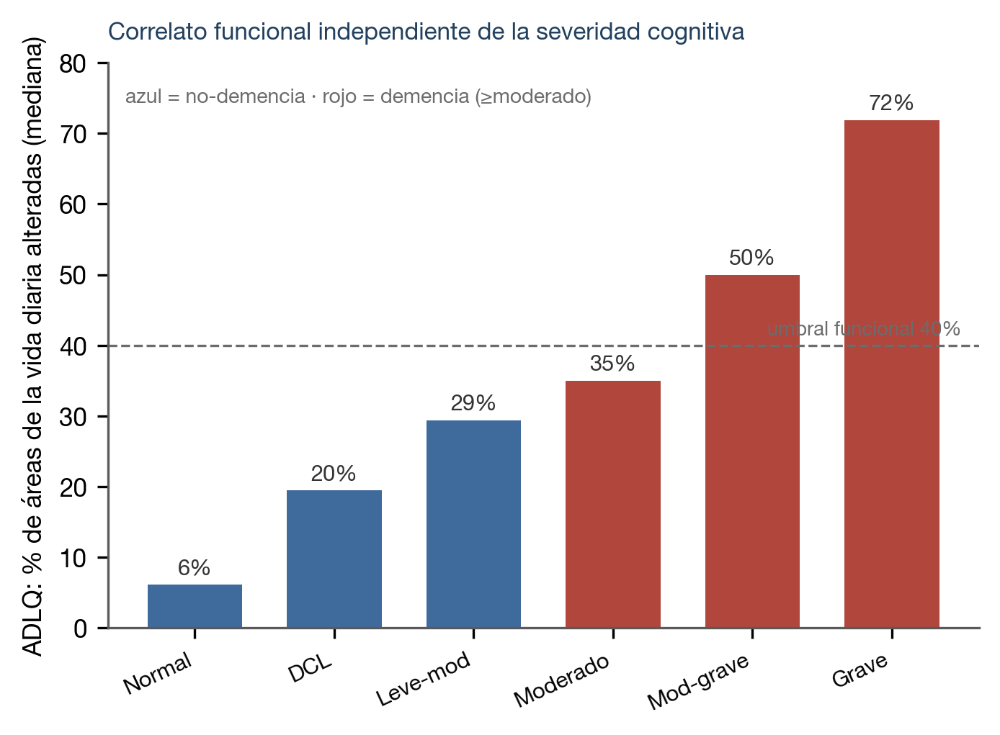
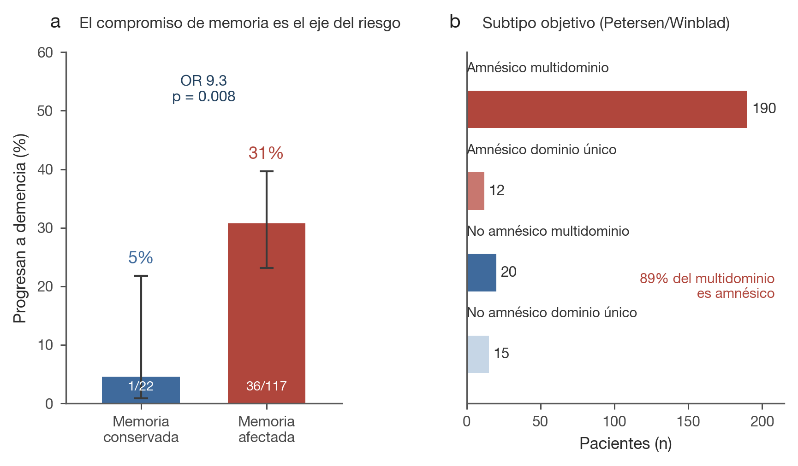

# Material suplementario

**Trayectorias cognitivas longitudinales y predicción del agravamiento desde la evaluación basal en una clínica de memoria argentina.**
Márquez F. et al. — Congreso Argentino de Neurología (CAN). [← volver al manuscrito](../MANUSCRIPT.md) · [código](https://github.com/fermarquez88/kaizenai-demencia)

Este documento reúne los análisis, tablas y figuras que —por **mérito** (exploratorios, no confirmatorios) o por **límites de norma** del CAN— no integran el cuerpo principal. Todo es reproducible desde los datos (los datos individuales son sensibles y no se comparten; el código sí).

---

## S1. Métodos ampliados

**Índice de Cambio Fiable (RCI) regression-based (SRB).** Cada test se re-escaló a una referencia común (mediana/MAD de la basal, congelada). El cambio se modeló con regresión del puntaje final sobre el basal y el intervalo en un grupo de referencia estable (Crawford-Howell), y el residuo estandarizado (RCI) clasifica cada caso como cambio fiable (RCI ≤ −1,645), mejora (≥ +1,96) o estable. Los pacientes ya-en-piso al basal (z crudo ≤ −3) se excluyeron del denominador de cambio. La multiplicidad se controló por FDR (Benjamini-Hochberg). **Ningún contraste a nivel de test sobrevivió FDR** (Tabla S1).

**Codificación por LLM.** La sección *Conclusiones* de cada informe firmado se codificó con un modelo de lenguaje restringido por un codebook cerrado (banda de severidad ordinal, mecanismo de memoria, moduladores). Fiabilidad entre dos codificaciones ciegas: severidad κ=1,00; subtipo κ=0,88 (consistencia de extracción; **pendiente** validación contra experto humano).

**Imputación y datos faltantes.** El predictor primario (memoria de relatos diferida) faltó en 13/140 (9%) de la cohorte leve-moderado; se imputó por la mediana **dentro** de cada pliegue de la validación cruzada. Casos completos: 127/35, con AUC concordante.

**Calibración.** Modelo primario: pendiente de calibración 0,88; Brier 0,21; el ajuste con ponderación por clases sobre-estima el riesgo absoluto (intercepto-in-the-large ≈ −0,19), recalibrado por Platt en el despliegue. La herramienta se interpreta como **estratificador de riesgo relativo por terciles**, no como calculadora de probabilidad individual exacta.

**Moduladores no predictivos.** Añadir a memoria + edad la depresión (GDS) o las quejas cognitivas (CQC) **no** mejoró la discriminación (la memoria ya captura la señal); se reportan como covariables descriptivas.

---

## S2. Tabla S1 — Trayectoria por test (RCI regression-based) con corrección FDR

Orden por Δz ajustado (más negativo = más cambio). **Ningún test alcanza q<0,05** (mínimo q=0.091); por lo tanto los patrones por test se interpretan como **descriptivos/generadores de hipótesis**, no confirmatorios.

| Test | Dominio | n | Δz ajust. | % cambio fiable | % mejora | % piso | p | q (FDR) |
|---|---|---|---|---|---|---|---|---|
| F Verbal Semántica | lenguaje | 240 | -0,25 | 17 | 7 | 9 | 0,007 | 0,091 |
| Dígitos-span · Atrás | funciones_ejecutivas | 249 | -0,18 | 18 | 10 | 22 | 0,019 | 0,151 |
| Lista de Rey · Trial 1 | memoria | 239 | -0,17 | 10 | 2 | 6 | 0,026 | 0,159 |
| Claves (WAIS IV) | velocidad | 30 | -0,12 | 23 | 10 | 0 | 0,223 | 0,412 |
| Trail Making Test · A | atencion | 218 | -0,12 | 11 | 3 | 23 | 0,064 | 0,273 |
| Dígitos-span · Adelante | atencion | 239 | -0,11 | 5 | 2 | 0 | 0,008 | 0,091 |
| Test de Hayling | funciones_ejecutivas | 104 | -0,11 | 9 | 2 | 9 | 0,216 | 0,412 |
| Vocabulario (WAIS IV) | lenguaje | 96 | -0,11 | 14 | 7 | 0 | 0,192 | 0,412 |
| Test de Córdoba | atencion | 122 | -0,10 | 13 | 7 | 2 | 0,068 | 0,273 |
| Subíndice de Memoria de Trabajo (WAIS IV) | funciones_ejecutivas | 33 | -0,10 | 15 | 3 | 0 | 0,251 | 0,427 |
| Figura de Rey · Diferido | memoria | 195 | -0,09 | 12 | 6 | 10 | 0,083 | 0,283 |
| Matrices (WAIS IV) | razonamiento | 97 | -0,09 | 7 | 2 | 0 | 0,306 | 0,431 |
| Figura de Rey · Inmediato | memoria | 194 | -0,09 | 17 | 5 | 16 | 0,200 | 0,412 |
| F Verbal Fonológica | lenguaje | 240 | -0,09 | 12 | 6 | 2 | 0,137 | 0,410 |
| Subíndice de Velocidad de Procesamiento (WAIS IV) | velocidad | 32 | -0,07 | 19 | 6 | 0 | 0,435 | 0,549 |
| Trail Making Test · B | funciones_ejecutivas | 127 | -0,06 | 8 | 4 | 12 | 0,475 | 0,569 |
| Figura de Rey · Reconocimiento | memoria | 215 | -0,06 | 13 | 2 | 10 | 0,372 | 0,495 |
| WAT | premorbido | 117 | -0,06 | 16 | 12 | 0 | 0,285 | 0,427 |
| IFS | funciones_ejecutivas | 236 | -0,06 | 14 | 5 | 32 | 0,184 | 0,412 |
| Memoria de Relatos · Diferido | memoria | 205 | -0,04 | 25 | 11 | 34 | 0,276 | 0,427 |
| Memoria de Relatos · Inmediato | memoria | 206 | -0,03 | 10 | 6 | 3 | 0,561 | 0,641 |
| Búsqueda de Símbolos (WAIS IV) | velocidad | 31 | -0,02 | 6 | 6 | 0 | 0,806 | 0,868 |
| Lista de Rey · Diferido | memoria | 236 | -0,01 | 15 | 11 | 24 | 0,868 | 0,868 |
| Lista de Rey · Lista Distractora | memoria | 239 | 0,01 | 7 | 5 | 6 | 0,846 | 0,868 |

---

## S3. Tabla S2 — Subtipos objetivos (Petersen/Winblad) y mecanismo de memoria

| Subtipo (Petersen/Winblad) | n |
|---|---|
| Amnésico multidominio | 190 |
| No amnésico multidominio | 20 |
| No amnésico dominio único | 15 |
| Amnésico dominio único | 12 |
| Sin déficit objetivo | 8 |
| Indeterminado (memoria) | 6 |
| Indeterminado | 3 |

Entre los amnésicos, el mecanismo predominante es el de almacenamiento (firma hipocampal/temporal-medial):

| Mecanismo (entre amnésicos, n=202) | n | % de los evaluables |
|---|---|---|
| Almacenamiento (hipocampal/temporal-medial) | 122 | 70% |
| Recuperación (frontal) | 53 | 30% |
| No especificado | 27 | — |

El almacenamiento comprometido **enriquece** la caracterización del subtipo amnésico pero no estratifica el riesgo más allá del propio subtipo en esta muestra.

---

## S4. Tabla S3 — Matriz de transición de severidad completa (conteos, basal → reevaluación)

| Basal ↓ / Reeval → | Normal | DCL/leve | Leve-mod | Moderado | Mod-sev | Severo |
|---|---|---|---|---|---|---|
| **Normal** | 9 | 7 | 1 | 0 | 0 | 0 |
| **DCL/leve** | 6 | 60 | 12 | 15 | 1 | 2 |
| **Leve-mod** | 0 | 12 | 13 | 13 | 5 | 1 |
| **Moderado** | 0 | 1 | 2 | 31 | 6 | 8 |
| **Mod-sev** | 0 | 0 | 0 | 2 | 2 | 4 |
| **Severo** | 0 | 0 | 1 | 1 | 2 | 2 |

Sobre la diagonal = progresión. Ningún paciente normal al basal progresó a demencia (0/17).

---

## S5. Validación funcional del desenlace (ADLQ del informante) — criterio independiente

La demencia se definió por severidad clínica; el **ADLQ del informante** (compromiso en actividades de la vida diaria) aporta un **criterio funcional independiente** de la narrativa cognitiva. El compromiso funcional crece de forma **monótona con la severidad cognitiva** y separa al grupo con demencia (≥ moderado) del resto — sostén del constructo (deterioro cognitivo **y** funcional) y atenuación de la circularidad.

| Severidad final | n con ADLQ | ADLQ mediana (% áreas) | % con ≥40% alterado |
|---|---|---|---|
| Normal | 6 | 6% | 0% |
| DCL | 40 | 20% | 18% |
| Leve-mod | 13 | 29% | 15% |
| Moderado | 39 | 35% | 46% |
| Mod-grave | 10 | 50% | 60% |
| Grave | 13 | 72% | 77% |

*Grupo con demencia (≥ moderado): ADLQ mediana 42% de áreas alteradas, 55% con ≥40%; no-demencia: 19% y 15%. Cobertura del ADLQ ~63% (limitación).*

---

## S6. Tabla S4 — Modelo funcional exploratorio (ADLQ como desenlace) — NO desplegado

Análisis de sensibilidad que restringe el desenlace con un criterio funcional independiente (ADLQ del informante ≥ 40% de áreas alteradas **y** severidad ≥ moderada). Se reporta como **exploratorio** por su fragilidad; **no** integra el artefacto desplegado.

| Cohorte | n | Eventos funcionales | EPV | AUC [rango entre folds] |
|---|---|---|---|---|
| Leve-moderado, criterio funcional ADLQ | 74 | 11 | 5,5 | 0,84 [0,56–1,00] |

El eje de memoria se mantiene bajo el criterio funcional, pero la escasez de eventos (EPV 5,5) y el rango que roza 0,56 impiden cualquier afirmación de rendimiento; es **generador de hipótesis**.

---

## S6. Figura S1 — El eje del riesgo: memoria y subtipos (versión en barras)

(a) Progresión por estado de memoria basal (afectada vs conservada; OR de Fisher 9,3; p=0,008). (b) Distribución de subtipos objetivos; el multidominio es 89% amnésico (190/214). Complementa la Figura 4 del cuerpo (Kaplan-Meier), que muestra el mismo eje en el tiempo.

## S7. Figura S2 — Regresión a la media en el cambio seriado

Puntaje basal vs reevaluación (memoria diferida re-escalada). La pendiente < 1 evidencia la regresión a la media que el RCI regression-based descuenta; ignorarla invierte el orden aparente de los cambios.

---

*Generado reproduciblemente desde la base congelada del Instituto de Neurociencias San Juan (Clínica El Castaño). Cifras exploratorias, unicéntricas.*
